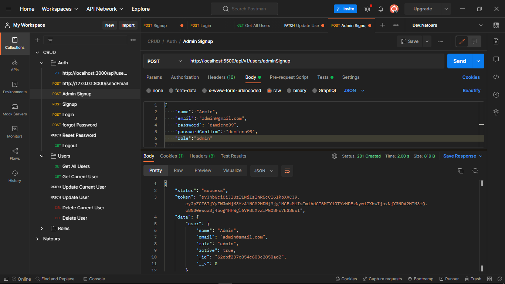
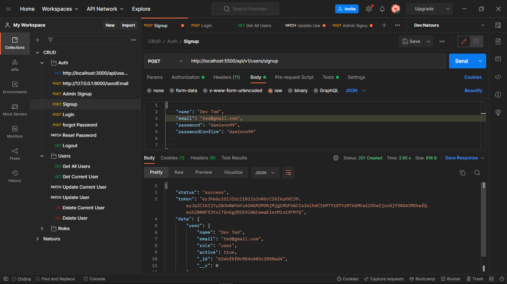
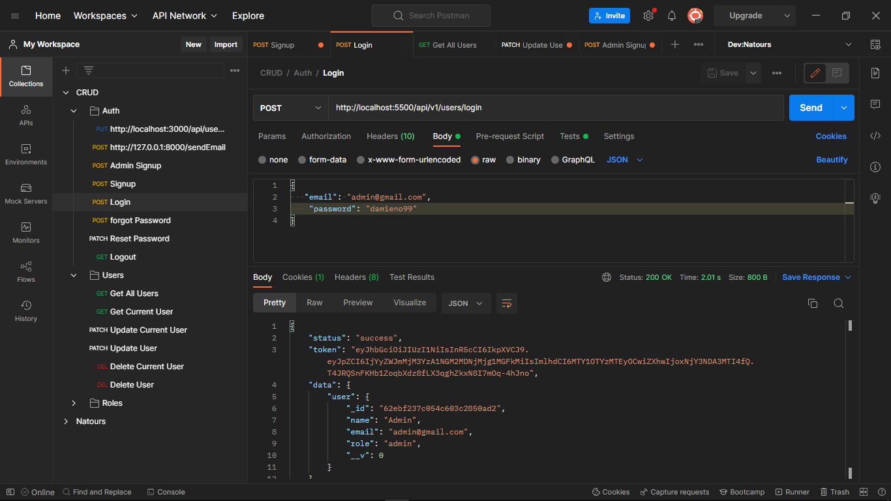
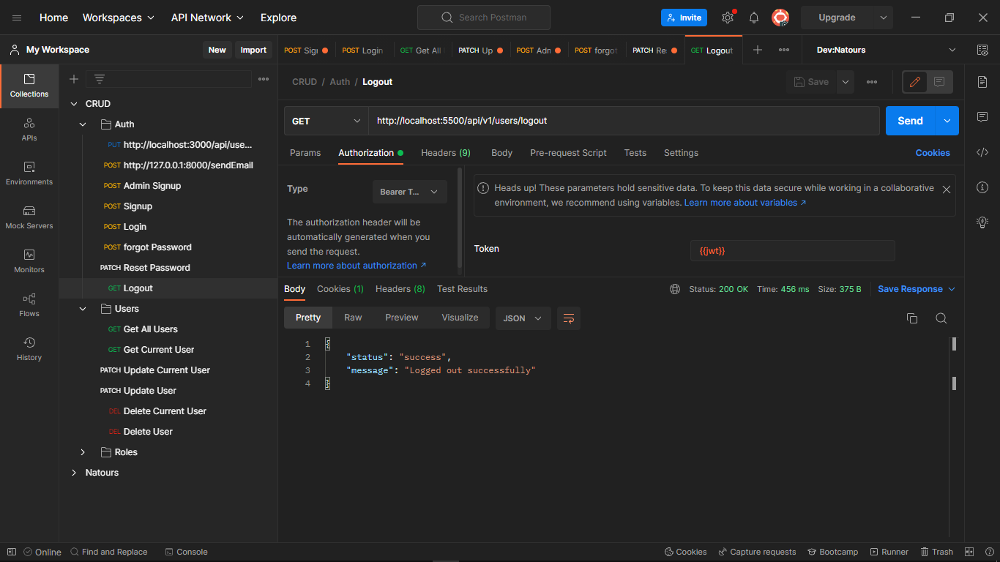
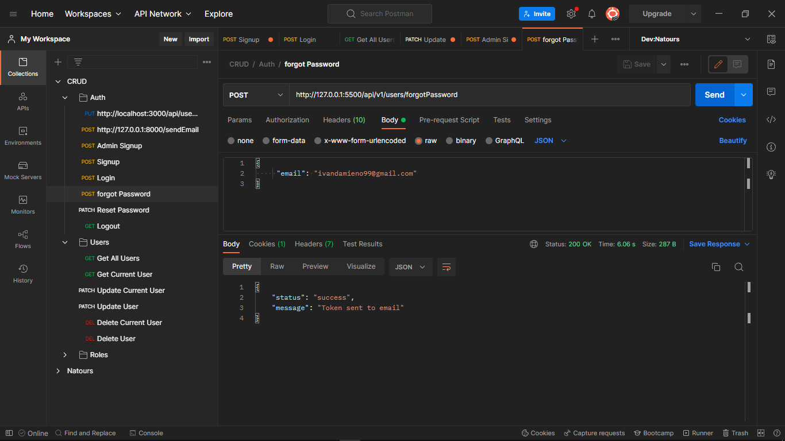
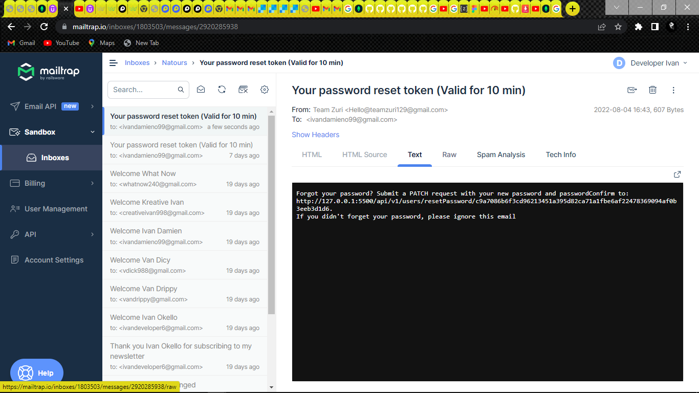
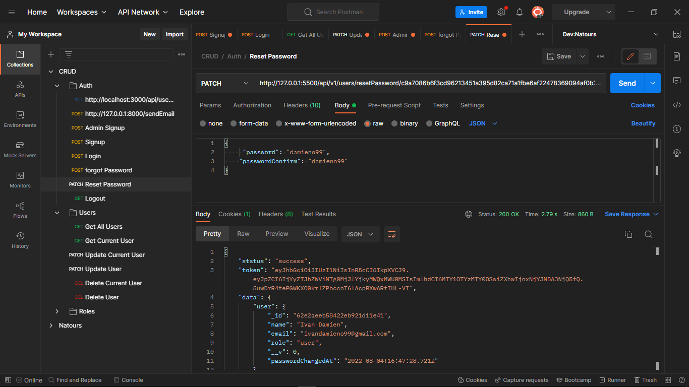
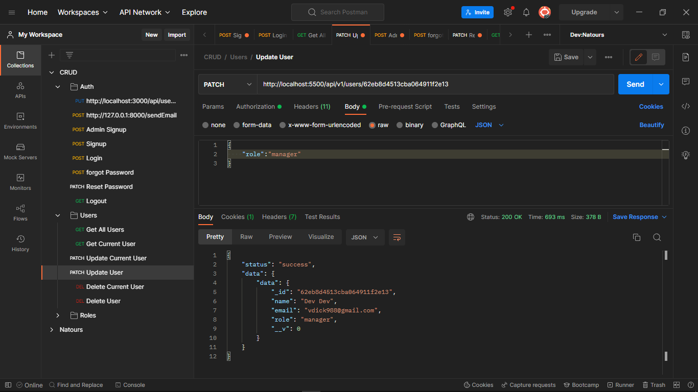
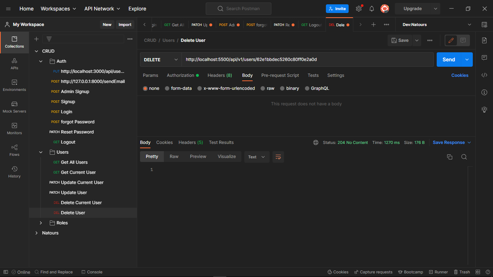

# **Authentication System**

### This is a complete authentication system with the following features!
### 1. Register, Login, Logout (use of bcrypt to hash password)
### 2. Add roles for users, staff, managers, admin
### 3. protect the user route, staff route, manager route, and     admin route with JSON web token
### 4. password recovery

---
### Signup consist of two routes, `adminSignup` route and `userSignup` route.

### All users cannot access other routes unless authenticated
### Regular Authenticated  users can `only` access routes such as 
- /me
- /updateMyPassword
- /updateMe
- /deleteMe

### Authenticated Users who have been given roles such as `admin`, `staff` and `manager` are able to access routes such as
- /getAllUsers
- /createUser
- /getUser/:id
- /updateUser/:id
- /deleteUser/:id

### Roles stated are `user`, `staff`, `manager` and `admin`.
### The default role is `user`
### The `admin`,`manager` and `staff` is able to UpdateUser, CreateUser, DeleteUser, manage user roles and retrieve all users data. 
---

## AdminSignup route
### This route is only accessible to the `admin`
Below is the screenshot of the admin signup

## userSignup route
### This is the default route for regular users to register

## login route
### This is the default route for all users to login to their accounts

## logout/signout route
### This is the default route for all users to logout of their accounts

## forgotPassword route
### This route  is for all users who have forgotten their password to input their emails so that password reset token is send to them

### for this i have used mailtrap to recieve emails and below is the screenshot of the email with password reset token

## resetPassword route
### This is the default route for all users to reset their passwords using the token sent via email

### The below routes are accessible only to `admin`,`managers` and `staff`

### ***Only the admin is able to manage roles such as making a regular user to be a manager or staff***

## updateUser route
### This route is accessible to `admin` to be able to modify user's data such as changing roles, activating and deactivating  as well as deleting user

## getAllUsers route
### This route is accessible to `admin``manager` and `staff` to be able to access all the user data

## deleteUser route
### This route is accessible to `admin``manager` and `staff` to be able to activate and deactivate  as well as delete a user

